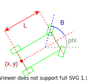
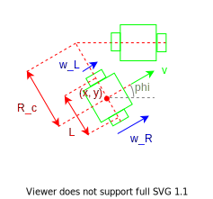

# UGV 2D Kinematics

The states of the UGV are the global cartesian coordinates and heading w.r.t the x-axis counter-clockwise:
$$
\vec{x}(t) = \left(\begin{matrix} x(t) \\ y(t) \\ \phi(t) \end{matrix}\right)
$$

The change in states over time is a function of its states and inputs and is given as:
$$
\frac{d\vec{x}(t)}{dt} = \frac{d}{dt}\left(\begin{matrix} x(t) \\ y(t) \\ \phi(t) \end{matrix} \right)=
    \left(
        \begin{matrix}
            v(t) \cdot \cos\left(\phi(t)\right) \\
            v(t) \cdot \sin\left(\phi(t)\right) \\
            \omega(t) \\
        \end{matrix}
    \right)
$$

- $v$ is the linear velocity in x-y directions.
- $w$ is the angular velocity.

The inputs dictates the equations of $v$ and $w$ and differs between UGV types.

The change in states over discrete time where $\tau$ is the timestep is given as:
$$
\frac{d\vec{x}(t + \tau)}{dt} = \frac{d}{dt}\left(\begin{matrix} x(t + \tau) \\ y(t + \tau) \\ \phi(t + \tau) \end{matrix} \right) =
    \left(\begin{matrix} x(t) \\ y(t) \\ \phi(t) \end{matrix}\right) + \tau
    \left(
        \begin{matrix}
            v(t) \cdot \cos\left(\phi(t)\right) \\
            v(t) \cdot \sin\left(\phi(t)\right) \\
            \omega(t) \\
        \end{matrix}
    \right)
$$

## Ackermann

The inputs to the Ackermann model is:
$$
\vec{u}(t) = \left(\begin{matrix} v(t) \\ \beta(t) \end{matrix}\right)
$$

Since the input specifies $v(t)$, the linear velocity is trivially:
$$
v(t) = v(t)
$$

The angular velocity is:
$$
\omega(t) = \frac{v(t)}{L} \cdot \tan\left(\beta(t)\right)
$$

- $\beta$ is the steering angle.

The change in states over time is therefore:
$$
\frac{d\vec{x}(t)}{dt} =
    \left(
        \begin{matrix}
            v(t) \cdot \cos\left(\phi(t)\right) \\
            v(t) \cdot \sin\left(\phi(t)\right) \\
            \frac{v(t)}{L} \cdot \tan\left(\beta(t)\right) \\
        \end{matrix}
    \right)
$$

## Two-Wheel Differential

The inputs to the differential model is:
$$
\vec{u}(t) = \left(\begin{matrix} \omega_{L}(t) \\ \omega_{R}(t) \end{matrix}\right)
$$

- $\omega_{L}$ is the angular velocity of the left wheel.
- $\omega_{R}$ is the angular velocity of the right wheel.

The linear velocity is:
$$
v(t) = \frac{R_{wheel}}{2}\left(\omega_{L}(t) + \omega_{R}(t)\right)
$$

The angular velocity is:
$$
\omega(t) = \frac{R_{wheel}}{L}\left(\omega_{R}(t) - \omega_{L}(t) \right)
$$

The change in states over time is therefore:
$$
\frac{d\vec{x}(t)}{dt} =
    \left(
        \begin{matrix}
            \frac{R_{wheel}}{2}\left(\omega_{L}(t) + \omega_{R}(t)\right) \cdot \cos\left(\phi(t)\right) \\
            \frac{R_{wheel}}{2}\left(\omega_{L}(t) + \omega_{R}(t)\right) \cdot \sin\left(\phi(t)\right) \\
            \frac{R_{wheel}}{L}\left(\omega_{R}(t) - \omega_{L}(t) \right) \\
        \end{matrix}
    \right)
$$
