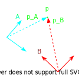
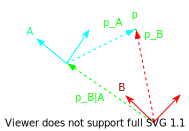
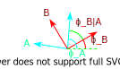

# Linear Algebra

## Rigid Transformations

A rigid transformation of a vector, $\vec{p}$, linearly transforms $\vec{p}$ from the coordinate frame, $A$, to coordinate frame, $B$, by rotation, $R$, and translation, $T$:

$$
\begin{aligned}
    \vec{p}_{B} = \vec{R}_{A \rightarrow B} \cdot \vec{p}_{A} + \vec{T}_{A \rightarrow B}
\end{aligned}
$$

> $p$ is the same vector expressed in two different coordinate frames.

### Translation

$T$ is the translation matrix:
$$
\vec{T}_{A \rightarrow B} = \vec{p}_{B|A} = \vec{p}_{B} - \vec{p}_{A}
$$

### Rotation

Let $\phi$ be the angle between the two coordinate frames:
$$
\phi_{B|A} = \phi_{B} - \phi_{A}
$$

In 2D:
$$
\vec{R}_{A \rightarrow B} = \vec{R}_{\phi_{B|A}} = \left(\begin{matrix} cos(\phi_{B|A}) & -sin(\phi_{B|A}) \\ sin(\phi_{B|A}) & cos(\phi_{B|A}) \end{matrix}\right)
$$

If the direction of the rotation matrix was inversed:
$$
\vec{R}_{A \rightarrow B} = \left(\vec{R}_{B \rightarrow A}\right)^{-1} = \left(\vec{R}_{B \rightarrow A}\right)^{T}
$$
