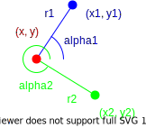

# Localisation

## Map-Based Localisation

### Trilateration

Trilateration determines an object's $(x, y)$ location from a set of $n$ landmarks:

$$
\left\{r_{k} - \sqrt{\left(x - x_{k}\right)^{2} + \left(y - y_{k}\right)^{2} } = 0 \right\}_{k = 1}^{n}
$$

### Triangulation

Triangulation determines an object's heading, $\phi$, from a set of $n$ landmarks:

$$
\left\{r_{k} - \sqrt{\left(x - x_{k}\right)^{2} + \left(y - y_{k}\right)^{2} } = 0 \right\}_{k = 1}^{n}
$$

> The more landmarks, the more accurate the trilateration and triangulation.