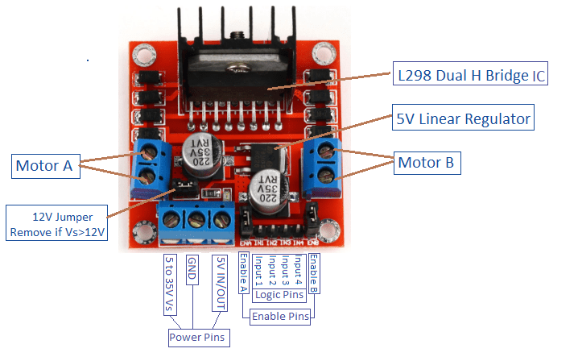

# Motor Drivers

A motor driver outputs high current signals from low current signals. It is the interface between the motor controller and motor.

## H-Bridge

Most motor drivers have a H-bridge which can switch the current polarity of a DC motor.

## Selecting Motor Drivers

### Motor Compatability

Pick a motor driver that is compatible with your type of motor. There are different types of motors: brushless DC motors, stepper motors, AC motors, etc.

### Interface

Pick an appropriate signal and number of channels to drive your motors. You can have 2 to many motors which are driven using PWM.

### Voltage & Current

The motor driver should have the right voltage and current handling capacity for the motor.

### On-State Resistance

Prefer an IC with lower on-state resistance to minimise power dissipation.

## L298N Motor Driver

This motor driver is the most common and basic motor driver available.
- The motor driven is supplied by the 5 - 35 V and GND power pins.
- Login and enable pins send PWM signals to drive motors A and B.
- It also acts as a power supply with a 5 V power pin.
