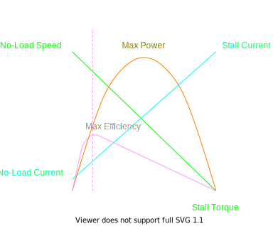

# Motors

## Motor Types

### Brushless DC Motor

## Motor Selection

1. Calculate wheel kinematics to determine a desired velocity and torque for the motor.

## Performance Curve

### Motor Type

### Loads