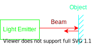

# Sensors

## 2D LiDAR

$$T = cD$$

- $T$ is time of flight.
- $c$ is speed of light.
- $D$ is travelled distance.

The measured time of flight is not perfect due to:
- Noise from dust, fog, rain.
- Echo from beam hitting multiple surfaces.
- Distortion due to misaligned beams due to motion.
- Decreased angular resolution with an increase in travelled distance.
- Surfaces with poor reflectivity.
- Inteference from other LiDAR or natural light.

## IMU

IMUs consist of:
- Accelerometer ( $\vec{\alpha}$ ):
- Magnetometer ( $\mu T$ ):
- Gyroscope ( $\vec{\omega}$ ):

$$ $$

## Motor Encoders