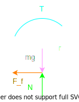

# Drive System

## Wheel Configurations

## Wheel Kinematics

### Design for Velocity

To figure out how fast the platform is moving from the motor's angular velocity, we need to consider the wheel:

$$
v = r\omega
$$

> Increasing the wheel radius will increase the platform's velocity for the same angular velocity.

### Design for Torque or Acceleration

To figure out how much torque is required to move the platform, consider the forces acting on the wheel:
$$
\begin{aligned}
F_{T} &= \frac{T}{r} \\
F_{f} &= \mu N \\
N &= mg
\end{aligned}
$$

So the net force is:
$$
\begin{aligned}
F_{net} &= F_{T} - F_{f} \\
ma &= \frac{T}{r} - \mu mg
\end{aligned}
$$

To design for torque with an acceleration design constraint, the equation is rearranged as:
$$
T = mr(a + \mu g)
$$

To design for acceleration with a torque design constraint, the equation is rearranged as:
$$
a = \frac{T}{mr} - \mu g
$$

> Increasing the wheel radius will decrease the platform's net force.

## Motor Selection

A desired velocity and torque should be decided before selecting a motor.

### Motor Type

### Loads

### Battery Life

## Gear Train

Gearing can be considered if the selection of motors is limited.
