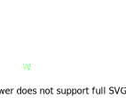
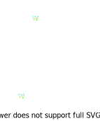
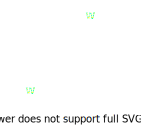
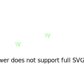
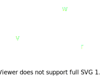
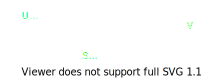

# Wheels

## Wheel Types

### Standard Wheel

### Castor Wheel

### Mecanum Wheel

### Ball Wheel

## Wheel Kinematics

### Design for Velocity

To figure out how fast the platform is moving from the motor's angular velocity, we need to consider the wheel:

$$
v = r\omega
$$

> Increasing the wheel radius will increase the platform's velocity for the same angular velocity.

### Design for Acceleration with Kinematic Constraint

We can design for acceleration of the wheel from zero to top speed.

Using distance to accelerate, $s$, as the design constraint:
$$
a = \frac{v^2}{2s}
$$

Where:
- $v$ is the final velocity.
- $s$ is the distance travelled while accelerating.

> Decreasing the distance while accelerating will increase the vehicle's acceleration.

Using time to accelerate, $t$, as the design constraint:
$$
a = \frac{v}{t}
$$

### Design for Torque

To figure out how much torque is required to move the platform, consider the forces acting on the wheel:
$$
\begin{aligned}
T &= r F_{f} \\
F_{f} &= \mu N \\
N &= mg
\end{aligned}
$$

Therefore, the minimum torque required is:
$$
T = r\mu mg
$$

> Note that the mass is distributed per wheel and not total mass.

### Design for Acceleration with Torque Constraint

To get the acceleration as a function of torque:

$$
\begin{aligned}
\sum{F_{x}} &= F_{f} \\
ma_{x} &= \frac{T}{r} \\
a_{x} &= \frac{T}{mr}
\end{aligned}
$$
